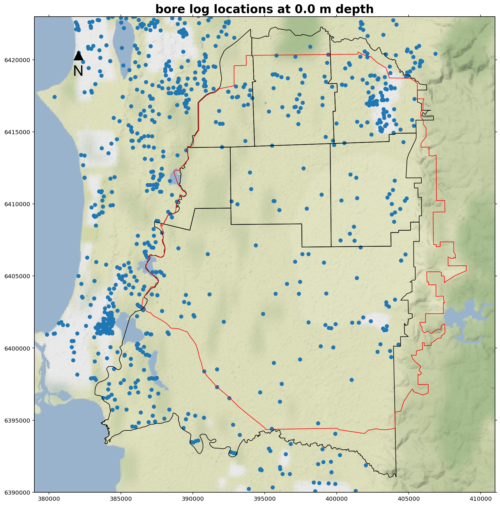
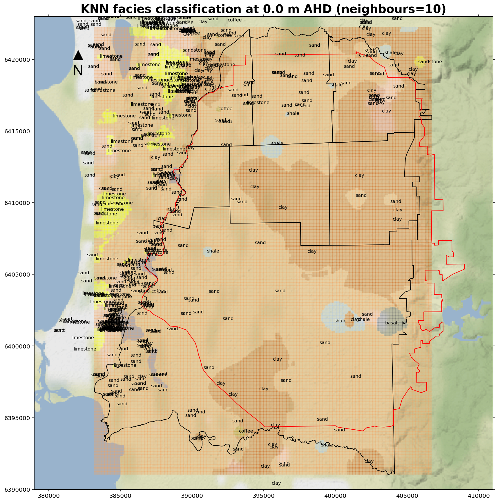
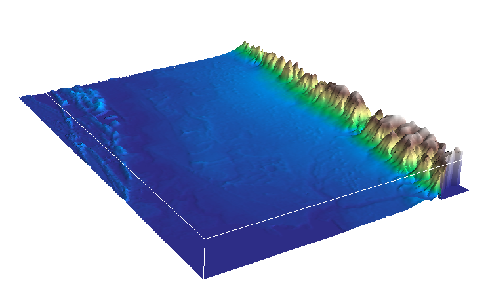
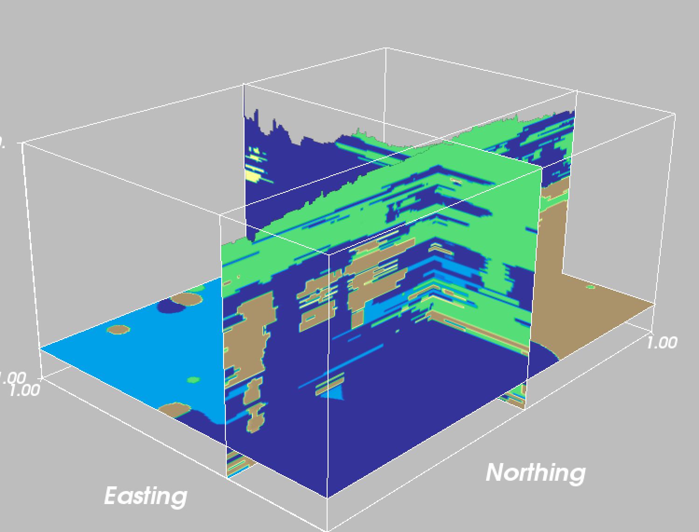
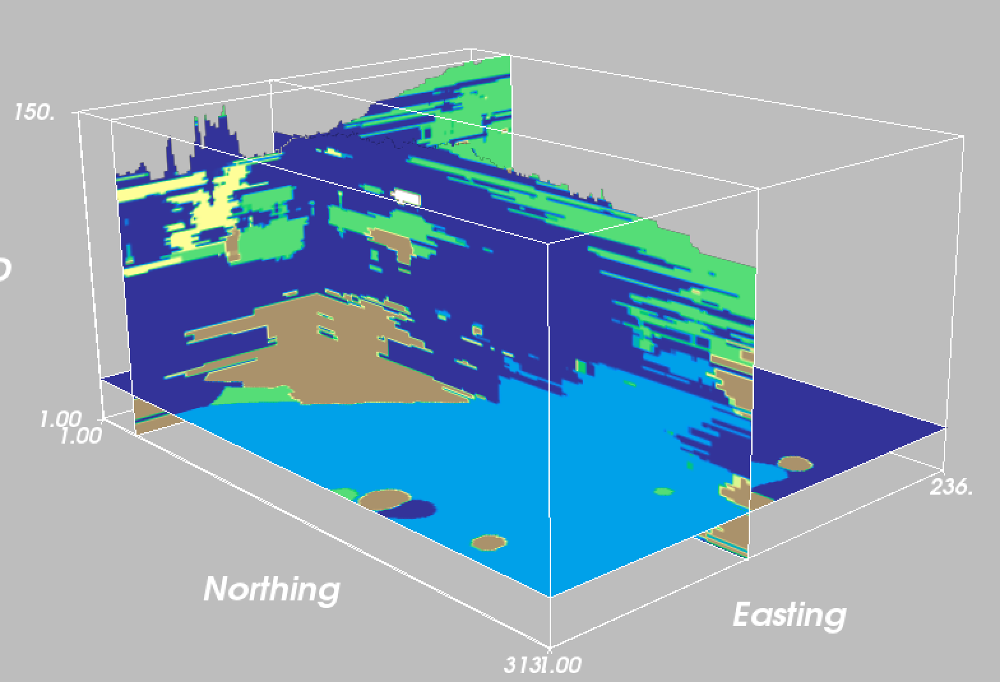
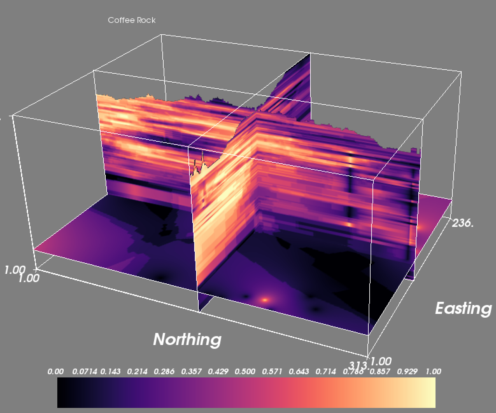
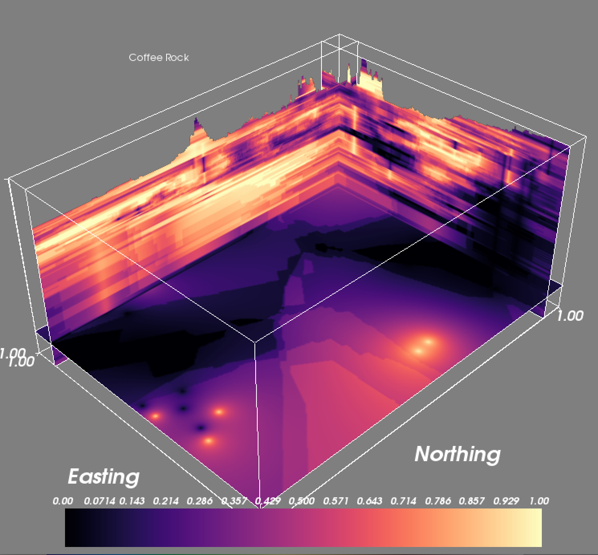

# Exploratory Lithology Analysis (pyELA)

Analysing driller’s logs is tedious and repetitive task in many groundwater modelling projects. Automating the process of extracting useful information from driller's logs would allow spending less time on data management and more time on its interpretation.

This workflow combines natural language processing and supervised machine learning to pre-process and subsequently interpolate verbal descriptions of lithology, as they typically appear in driller's logs. 

 

 

 

## Dependencies:

- Pandas (data wrangling)
- Geopandas (adds geospatial capabilities to Pandas)
- nltk (natural language processing)
- Cartopy (geospatial mapping)
- ipywidgets (interactive plots)
- rasterio (read/write/visualise raster data)
- Mayavi (3d visualisation and fence diagrams)
- Scikit-learn (supervised machine learning, KNN)
- matplotlib
- math
- functools
- os
- glob
- collections
- Scipy

